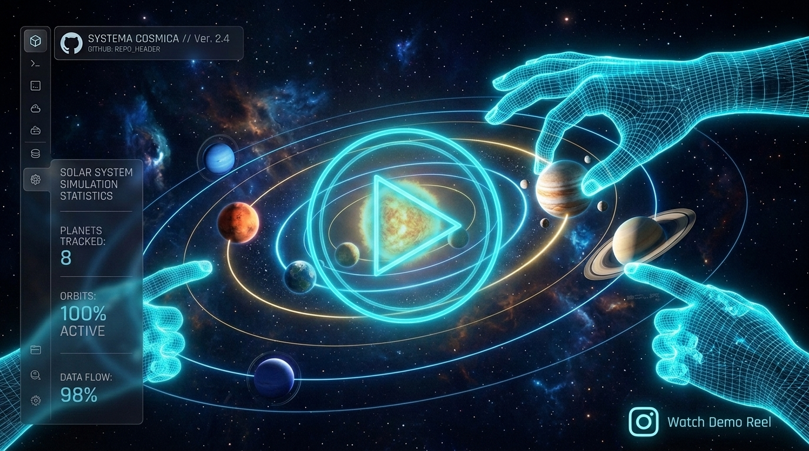

<div align="center">

# 🌌 UniverseX

[](https://nextjs.org/)
[](https://threejs.org/)
[](https://google.github.io/mediapipe/)
[](https://www.typescriptlang.org/)
[](https://tailwindcss.com/)
[](https://www.instagram.com/reel/DavBOYWTfOn/)

### *A gesture-controlled, photorealistic 3D Solar System simulator. Point at planets to fly to them, pinch to zoom, and scale the cosmos with your bare hands.*

<a href="https://www.instagram.com/reel/DavBOYWTfOn/" target="_blank">
  
</a>

</div>

---

## 🌟 Key Features

*   **✨ Immersive WebGL Scene:** A rich photorealistic environment featuring custom shader-based planetary atmospheres, volumetric solar flares, animated orbit rings, and dynamic space dust/nebulae.
*   **🖐️ Real-time Hand Gesture Engine:** Uses **MediaPipe Hand Landmarker** running entirely client-side via WebAssembly to process webcam feeds, translating hand movements into actions with zero network overhead.
*   **🔮 Neon Telemetry UI:** High-fidelity glassmorphism overlay displaying hand tracking status, system FPS, and astronomical facts about selected celestial bodies.
*   **⚡ Zero-Latency Smoothing:** Implements double-exponential smoothing and gesture confirmation windows to eliminate raw tracking noise and frame jitter.
*   **🔒 Privacy-First Design:** All camera frames are processed locally in your browser. No video data, metadata, or images are ever uploaded.

---

## 🎮 Interactive Gesture Controls

Our custom `gestureEngine` ensures control exclusivity—there are no overlapping or ambiguous mappings.

| Hand | Gesture | Action Description |
|:---:|:---:|---|
| **Left Hand** | ✊ **Closed Palm** | Initiates smooth, automated rotation of the Solar System. |
| **Left Hand** | 🖐️ **Open Palm** | Immediately locks rotation, holding the Solar System at its current orientation. |
| **Right Hand** | 👆 **Point (Index)** | Projects a holographic laser pointer; hover over any planet for **~0.8s** to lock-on and fly to it. |
| **Right Hand** | 🤏 **Pinch** | Zoom the camera (widening fingers zooms in, closing fingers zooms out). |
| **Both Hands** | 👐 **Spread/Close** | Scaling gesture: move hands apart to scale the entire Solar System up, close them to scale down. |

> [!NOTE]
> Two-hand scaling takes priority over single-hand movements. Dropping one hand immediately freezes the system scale at its current value, preventing accidental rotations.

---

## 🛠️ Technology Stack

- **Framework:** Next.js 15 (App Router)
- **Languages:** TypeScript, GLSL (Custom Shaders)
- **Render Engine:** Three.js, React Three Fiber (R3F), @react-three/drei
- **AI Tracking:** Google MediaPipe (Hand Landmarker WebAssembly)
- **Animations:** Framer Motion
- **State Management:** Zustand
- **Styling:** Tailwind CSS (Modern Glassmorphic UI utilities)

---

## 📁 Repository Structure

The project follows a clean, component-driven architecture:

```
src/
├── app/
│   ├── layout.tsx         # App entry point, custom fonts, and global metadata
│   ├── page.tsx           # Page controller orchestrating webcam, tracking, and canvas
│   └── globals.css        # Core design tokens, Tailwind directives, and glassmorphism utilities
├── components/
│   ├── scene/
│   │   ├── Scene.tsx           # Canvas setup, studio lights, and post-processing passes
│   │   ├── Sun.tsx             # Shader-animated plasma Sun with concentric glow layers
│   │   ├── Planet.tsx          # Celestial body renderer (mesh, atmosphere, rings, moons)
│   │   ├── OrbitRing.tsx       # Vector orbital path highlighting on select
│   │   ├── SolarSystem.tsx     # Orbital position loops and master state binding
│   │   ├── SpaceBackground.tsx # Nebula gas sheets, starfield particles, cosmic dust
│   │   ├── CameraRig.tsx       # Smooth camera easing interpolator (orbital overview ↔ focus)
│   │   ├── PointerLaser.tsx    # Raycasting laser originating from tracked fingertip
│   │   └── FpsTracker.tsx      # Rolling-window framerate metric
│   ├── hands/
│   │   └── HolographicHands.tsx # Neon skeletal joint connector and finger trail effects
│   └── ui/
│       ├── TopBar.tsx          # Real-time telemetry: gesture status, selection metrics
│       ├── PlanetInfoPanel.tsx # Glass-panel HUD highlighting planet scientific data
│       ├── StartOverlay.tsx    # User onboarding and camera hardware authorization
│       └── WebcamPreview.tsx   # Mirrored corner preview showing real-time MediaPipe overlay
├── hooks/
│   ├── useHandTracking.ts  # MediaPipe HandLandmarker lifecycle coordinator and frame loop
│   └── useGestureControl.ts # State dispatcher converting classified gestures to scene actions
├── lib/
│   ├── gestureEngine.ts    # Landmark geometry processor (vectors, distances, angles)
│   ├── handLandmarks.ts    # Index map definitions for MediaPipe's 21-point tracking model
│   ├── orbit.ts            # Astronomical translation algorithms
│   ├── math.ts             # Easing, lerp, and damp utility library
│   └── store.ts            # Global reactive state container (Zustand)
└── data/
    └── planets.ts          # Physical statistics and texture paths for rendering
```

---

## 🚀 Getting Started

### Prerequisites
*   Node.js 18.18+ (Node 20 LTS recommended)
*   A functional webcam

### Installation

1.  Clone the repository and install dependencies:
    ```bash
    git clone https://github.com/Sanchit-Singh-codes/universex.git
    cd universex
    npm install
    ```

2.  Start the development server:
    ```bash
    npm run dev
    ```

3.  Open [http://localhost:3000](http://localhost:3000) and click **Enable Camera & Begin**. Grant camera access to initialize local MediaPipe tracking.

### Production Build

To compile a highly optimized production bundle:
```bash
npm run build
npm run start
```

> [!WARNING]
> By default, `next/font/google` fetches font files at build time. If you are building in an offline/sandboxed container, make sure you have internet access or swap the imports in `src/app/layout.tsx` to fallback system fonts.

---

## ⚡ Performance Optimization

To ensure a smooth 60 FPS experience even with webcam and tracking active:
- **Geometry Sharing:** Planetary spheres share memoized geometries; only translation vectors and scale matrices update per-frame.
- **Render Throttle:** The FPS monitor samples telemetry every **0.5 seconds** rather than every frame to eliminate unnecessary React re-renders.
- **Landmark Interpolation:** Custom damping vectors smooth out tracked landmarks, avoiding micro-jitter without adding latency.
- **Efficient Bloom:** Post-processing uses cheaper mipmap-based glow paths to minimize GPU stress.

---

<div align="center">
Created with 💙 by <a href="https://github.com/Sanchit-Singh-codes">Sanchit-Singh-codes</a>
</div>
